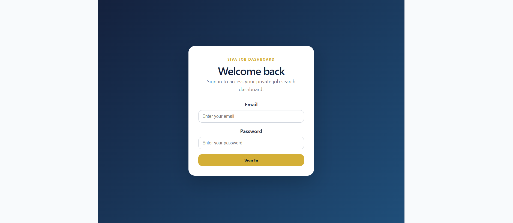
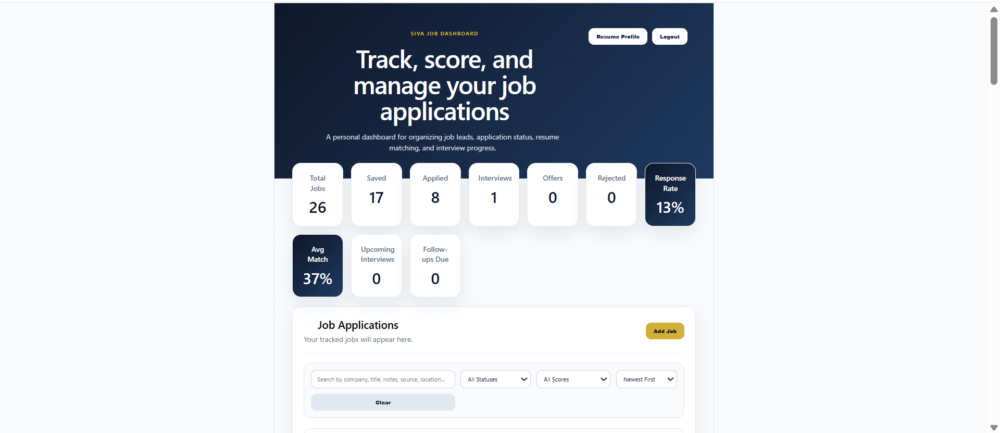
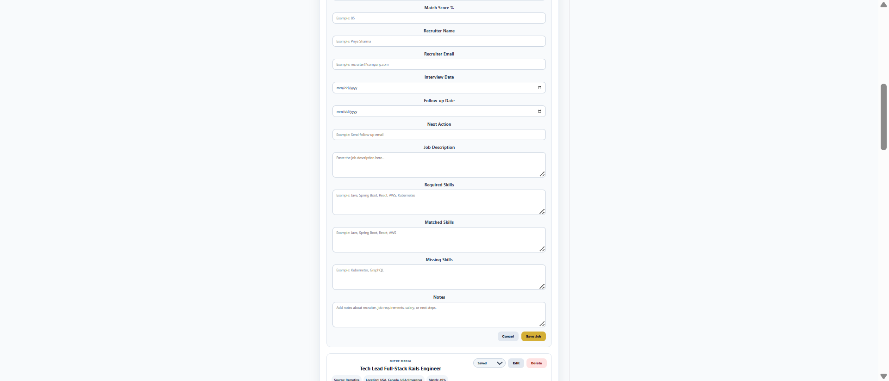
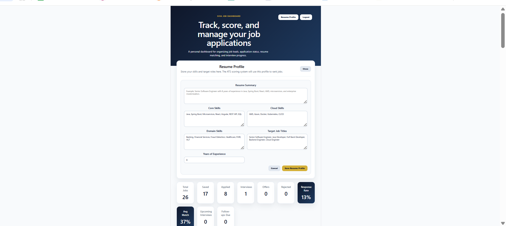
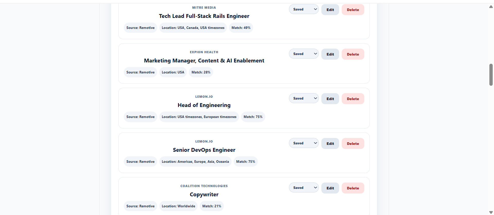

# Siva Job Dashboard

A full-stack job tracking and ATS scoring dashboard built with React, Firebase, FastAPI, Google Cloud Run, and Cloud Scheduler.

This project helps track job applications, calculate job match scores, import remote jobs automatically, and manage job search progress in one dashboard.

## Live Demo

Frontend: https://siva-job-dashboard.web.app  
Backend API: https://siva-job-dashboard-api-1015605186695.us-central1.run.app

## Features

### Frontend Dashboard

- Firebase Authentication login system
- Add, edit, delete, and update job applications
- Track job status: Saved, Applied, Interview, Offer, Rejected
- Search jobs by company, title, location, notes, source, and recruiter
- Filter jobs by status
- Filter jobs by 70%+ match score
- Sort jobs by company, status, salary, date applied, and newest first
- View job metrics including total jobs, applied jobs, interviews, offers, and average match score

### Resume Profile

- Store resume summary
- Store core technical skills
- Store cloud and DevOps skills
- Store domain experience
- Store target job titles
- Store years of experience
- Save and load profile from Firestore

### ATS Match Scoring

The application calculates a weighted ATS-style score using:

| Category | Weight |
|---|---:|
| Technical Skills | 40 |
| Job Title Match | 20 |
| Experience Match | 15 |
| Cloud / DevOps Skills | 15 |
| Domain Match | 10 |
| Total | 100 |

### Backend Automation

- FastAPI backend
- Remotive API job fetching
- HTML cleanup for imported job descriptions
- Duplicate detection using generated duplicate keys
- Firebase Admin SDK integration
- Backend ATS scoring for imported jobs
- Updates existing duplicate jobs instead of creating duplicates
- Saves imported jobs into Firestore
- Cloud Run deployment
- Cloud Scheduler automation every 30 minutes

## Tech Stack

### Frontend

- React
- Vite
- JavaScript
- CSS
- Firebase Authentication
- Cloud Firestore
- Firebase Hosting

### Backend

- Python
- FastAPI
- Uvicorn
- Requests
- Firebase Admin SDK
- Docker
- Google Cloud Run
- Google Cloud Scheduler

### Cloud

- Firebase Authentication
- Cloud Firestore
- Firebase Hosting
- Google Cloud Run
- Google Cloud Scheduler
- Google Cloud IAM
- Google Cloud Build
- Artifact Registry

## Architecture

```text
User
 |
 | uses
 v
React Frontend on Firebase Hosting
 |
 | reads/writes
 v
Firebase Authentication + Cloud Firestore
 ^
 |
 | writes imported jobs
 |
FastAPI Backend on Cloud Run
 |
 | fetches jobs
 v
Remotive Jobs API

Cloud Scheduler
 |
 | calls every 30 minutes
 v
Cloud Run /fetch-jobs endpoint
```

## Backend API Endpoints

| Endpoint | Description |
|---|---|
| `/` | Health check endpoint |
| `/test-firestore` | Tests Firestore connection |
| `/preview-jobs` | Previews fetched Remotive jobs without saving |
| `/fetch-jobs` | Fetches jobs, scores them, and saves/updates Firestore |

## Local Development

### Frontend

```bash
cd frontend
npm install
npm run dev
```

Frontend runs at:

```text
http://localhost:5173
```

### Backend

```bash
cd backend
python -m venv venv
.\venv\Scripts\Activate.ps1
pip install -r requirements.txt
python -m uvicorn main:app --reload --port 8010
```

Backend runs at:

```text
http://127.0.0.1:8010
```

## Deployment

### Frontend

```bash
cd frontend
npm run build
cd ..
firebase deploy --only hosting
```

### Backend

```bash
cd backend
gcloud run deploy siva-job-dashboard-api --source . --platform managed --region us-central1 --allow-unauthenticated --project siva-job-dashboard-backend
```

### Cloud Scheduler

The backend import job runs every 30 minutes:

```text
*/30 * * * *
```

Scheduler target:

```text
https://siva-job-dashboard-api-1015605186695.us-central1.run.app/fetch-jobs
```

## Security Notes

- Firebase Authentication protects user-specific frontend data.
- Firestore rules restrict frontend job access by authenticated user ID.
- Firebase Admin SDK is used only on the backend.
- Local service account key is excluded from GitHub using `.gitignore`.
- Cloud Run uses IAM permissions to access Firestore.

## Project Highlights

- Built a production-style full-stack application with React, Firebase, and FastAPI.
- Implemented ATS-style job matching with weighted scoring logic.
- Automated job ingestion from an external job API.
- Deployed backend to Google Cloud Run using Docker.
- Automated recurring job imports with Cloud Scheduler.
- Integrated Firebase Admin SDK for secure backend Firestore writes.
- Implemented duplicate detection and update logic for imported jobs.

## Screenshots

### Login Screen



### Dashboard Overview



### Add Job Form



### Resume Profile



### Job Details with ATS Match Score



### Backend Imported Jobs


## Future Enhancements

- Add OpenAI or Gemini-powered job description summarization
- Add email alerts for high-match jobs
- Add user-configurable backend skill profile
- Add analytics charts for job search trends
- Add multi-source job importing from additional APIs
- Add recruiter contact tracking automation